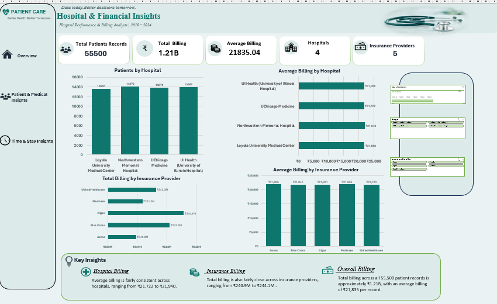

# Healthcare Data Analysis & Excel Dashboard

## 📌 Project Overview

This project focuses on analyzing healthcare data using Microsoft Excel to identify meaningful patterns and insights related to patients, medical conditions, hospitals, billing, insurance providers, test results, and length of stay.

The project transforms a large healthcare dataset into structured analysis and an interactive dashboard that makes key findings easier to understand and explore.

---
## 📊 Interactive Dashboard

---
## 🎯 Project Objective

The main objectives of this project are to:

- Clean and prepare healthcare data for analysis
- Create meaningful calculated fields for analysis
- Analyze patient and medical information
- Analyze hospital and financial information
- Examine test results and patient stay patterns
- Identify important insights from the data
- Build an interactive Excel dashboard for data visualization

---

## 📊 Dataset

**Dataset:** Healthcare Dataset  
**Source:** Kaggle  
**Author:** Eduardo Licea

🔗 [Healthcare Dataset on Kaggle](https://www.kaggle.com/datasets/eduardolicea/healthcare-dataset)

The dataset used in this project contains:

- **55,500 patient records**
- **16 original columns**
- **8 medical conditions**
- **4 hospitals**
- **5 insurance providers**
- Data covering **2019–2024**

### Key Variables

- Age
- Gender
- Blood Type
- Medical Condition
- Date of Admission
- Doctor
- Hospital
- Insurance Provider
- Billing Amount
- Admission Type
- Discharge Date
- Medication
- Test Results
- Length of Stay

---

## 🧹 Data Preparation

The dataset was inspected and prepared before analysis.

The preparation process included:

- Checking data quality
- Checking for missing values
- Checking for duplicate records
- Reviewing data formats
- Creating additional helper columns

### Helper Columns Created

- **Age Group**
- **Admission Year**
- **Admission Month**
- **Stay Category**

These additional fields supported grouped analysis and comparisons.

---

## 🔍 Analysis Performed

### 1. Patient & Medical Insights

- Patient records by gender
- Patient records by age group
- Medical condition distribution
- Medical condition by test result

### 2. Hospital & Financial Insights

- Patient records by hospital
- Average billing by hospital
- Total billing by insurance provider
- Average billing by insurance provider

### 3. Test Results

Analysis of:

- Normal results
- Abnormal results
- Inconclusive results

### 4. Time & Stay Analysis

- Admission trends
- Length of stay by medical condition
- Short-stay vs long-stay records
- Average billing by stay category

## 💡 Key Insights

Some of the key findings from the analysis include:

- **Cancer** had the highest average billing at approximately **₹64,537 per record**.
- **Long-stay records** had an average billing of approximately **₹31,978**, compared with **₹5,274** for short-stay records.
- **Abnormal test results** represented approximately **50.1%** of the records.
- **Middle Age and Senior** groups together represented approximately **60%** of the records.
- Female and male records were relatively balanced, at approximately **50.4%** and **49.6%** respectively.
- The eight medical conditions had relatively similar record counts, allowing comparison across conditions.

> These findings describe patterns in the dataset and do not establish medical or causal relationships.

---

## 🛠 Tools Used

**Microsoft Excel**

- Data Cleaning
- Excel Formulas
- PivotTables
- PivotCharts
- Slicers
- Timeline
- Data Visualization
- Dashboard Development
